# 🎬 CineMagic

> **Descubre la magia de Disney en un solo lugar.**

---

# 📖 Descripción del proyecto

**CineMagic** es una aplicación web desarrollada con **Vue 3** que permite explorar el universo de los personajes Disney a través de una interfaz moderna, intuitiva y completamente responsive.

La aplicación consume información en tiempo real desde la **Disney API**, ofreciendo a los usuarios la posibilidad de descubrir cientos de personajes, consultar información detallada, guardar sus favoritos y valorar aquellos que más les gustan.

Además de la navegación pública, CineMagic incorpora un sistema de autenticación con diferentes roles de usuario. Los usuarios registrados pueden acceder a un área privada donde gestionar su perfil, personalizar su avatar, administrar sus personajes favoritos y modificar la configuración de su cuenta. Por otro lado, los administradores disponen de un panel exclusivo desde el que pueden gestionar usuarios, configurar personajes destacados y seleccionar el **Personaje de la Semana**, que se muestra automáticamente en la página principal.

El proyecto ha sido desarrollado siguiendo una arquitectura basada en componentes reutilizables, utilizando **Pinia** para la gestión global del estado, **Vue Router** para la navegación entre vistas y **LocalStorage** para la persistencia de la información. Asimismo, se han implementado pruebas unitarias con **Vitest** y pruebas End-to-End con **Playwright**, garantizando el correcto funcionamiento de las principales funcionalidades de la aplicación.

---

# 🎯 Objetivos del proyecto

El objetivo principal de **CineMagic** es ofrecer una experiencia interactiva y dinámica para explorar personajes Disney, aplicando buenas prácticas de desarrollo frontend y utilizando tecnologías modernas del ecosistema de Vue.

Para ello, el proyecto persigue los siguientes objetivos:

- Consumir información desde una API externa.
- Implementar una arquitectura basada en componentes reutilizables.
- Gestionar el estado global de la aplicación mediante **Pinia**.
- Diferenciar funcionalidades según el rol del usuario (**usuario** y **administrador**).
- Permitir la personalización de la experiencia mediante favoritos, valoraciones y avatares.
- Diseñar una interfaz moderna, intuitiva y completamente responsive.
- Garantizar la calidad del proyecto mediante pruebas unitarias con **Vitest** y pruebas End-to-End con **Playwright**.

---
# 🏠 Vista principal

Link despliegue (https://lcortes89.github.io/project-p5-digital-academy-team4-the-univers-of-things/)

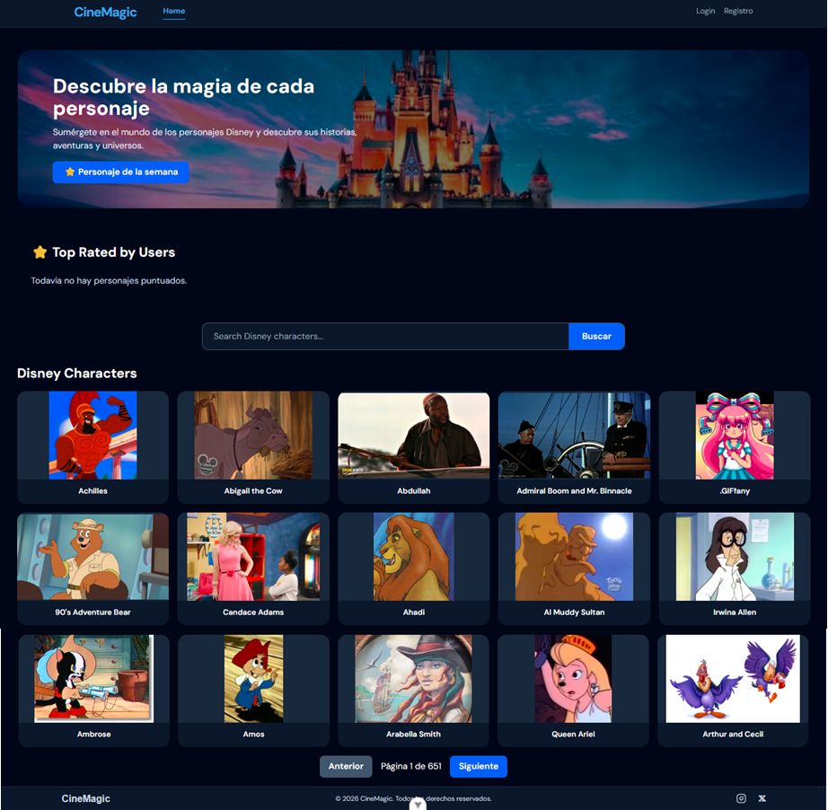

# ✨ Características principales

CineMagic reúne diferentes funcionalidades orientadas a ofrecer una experiencia completa tanto para usuarios registrados como para administradores.

# 📋 Gestión del proyecto (Jira)
Para la organización y planificación del desarrollo se utilizó *Jira*, aplicando una metodología *Scrum*.

Durante el proyecto se gestionaron:

Épicas.
Historias de usuario.
Tareas.
Sprints.
Seguimiento del progreso del equipo.

Jira permitió distribuir el trabajo entre los integrantes, realizar el seguimiento de las tareas y mantener una organización eficiente durante todo el desarrollo del proyecto.

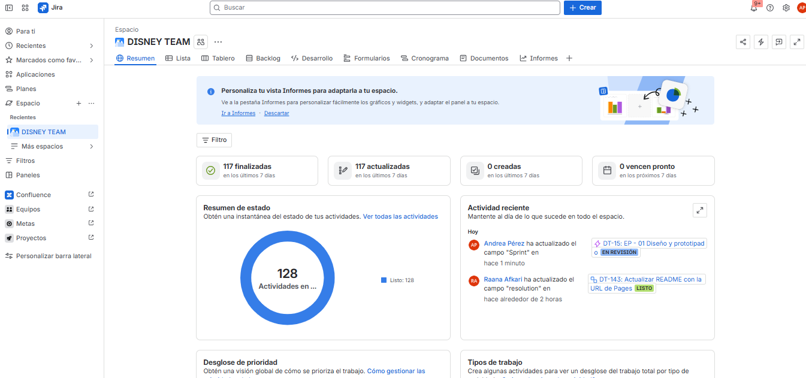

## 🏠 Página principal

- 🎭 Hero principal con presentación de la aplicación.
- 👑 Visualización del **Personaje de la Semana**.
- ⭐ Ranking dinámico **Top Rated by Users**.
- 🔍 Barra de búsqueda de personajes.
- 📄 Listado completo de personajes obtenido desde la **Disney API**.
- 📑 Paginación para navegar entre todos los personajes.
- 📄 Acceso a la vista de detalle de cada personaje.
- 📱 Diseño completamente responsive.
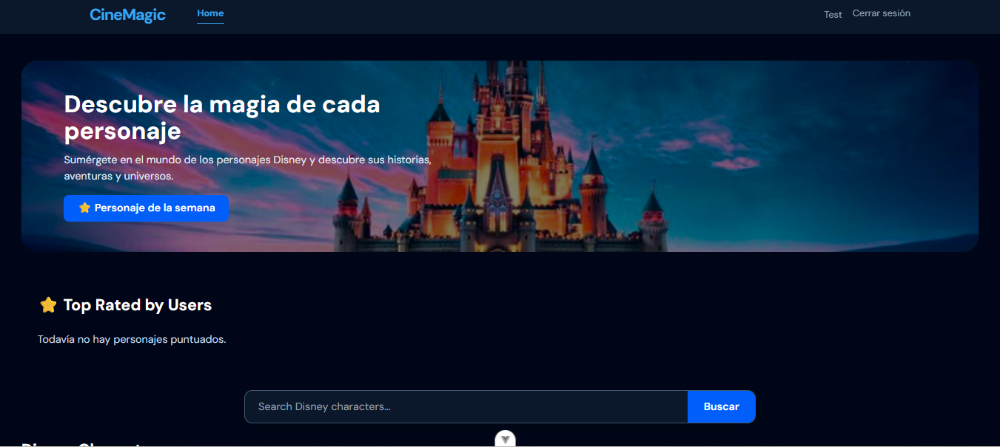
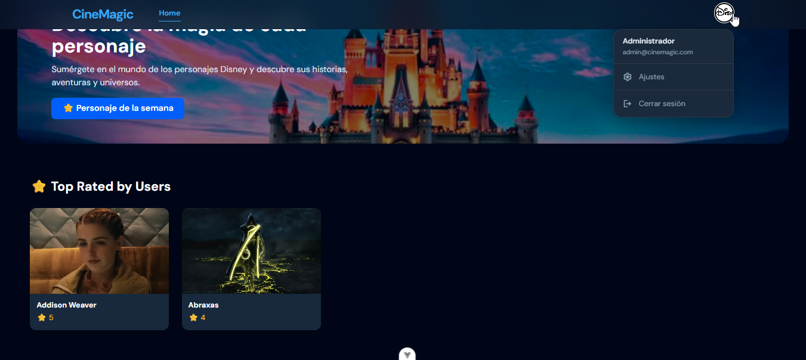
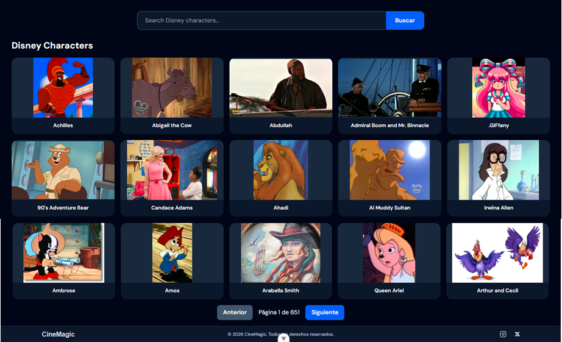
---

## 🔐 Sistema de autenticación

- Inicio de sesión para usuarios registrados.
- Registro de nuevas cuentas.
- Validación de credenciales.
- Persistencia de la sesión mediante LocalStorage.
- Diferenciación entre usuarios y administradores.
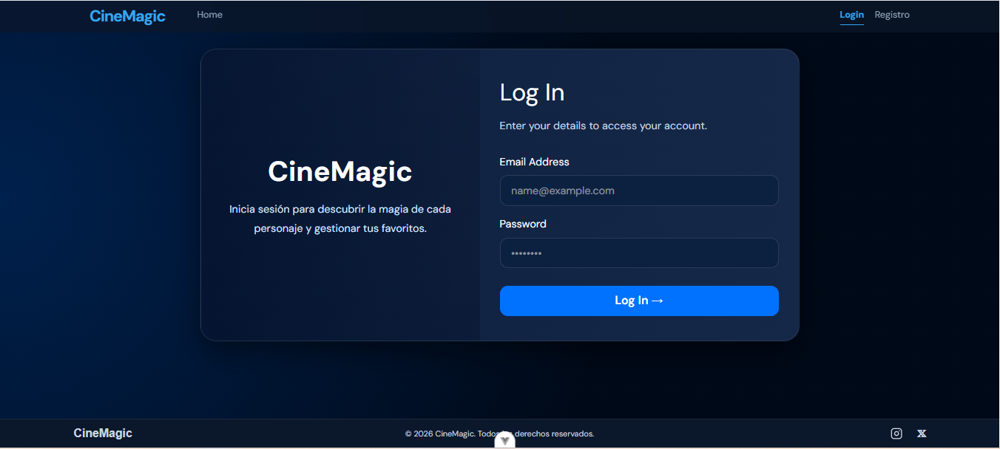
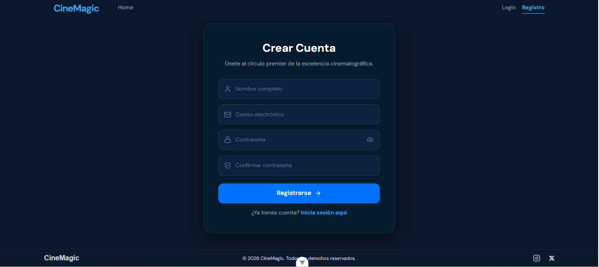
---

## 👤 Área privada del usuario

- Perfil personalizado.
- Cambio de avatar.
- Cambio de contraseña.
- Gestión de personajes favoritos.
- Sistema de valoraciones mediante estrellas.
- Sincronización automática de la información del usuario.
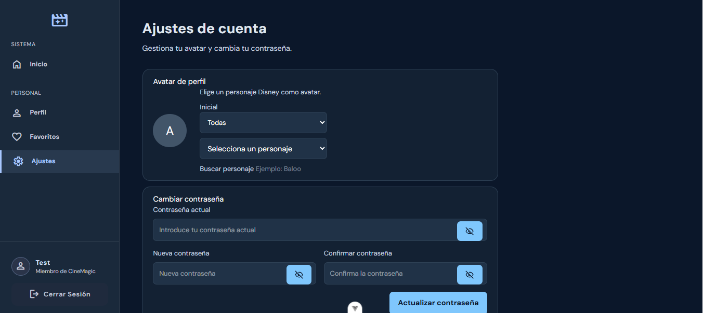
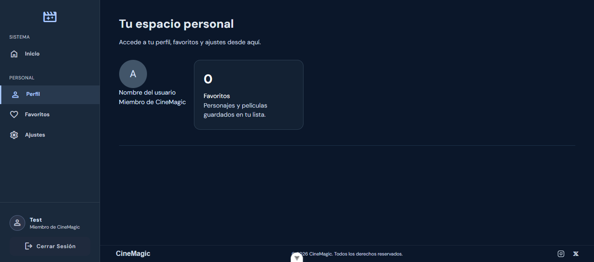
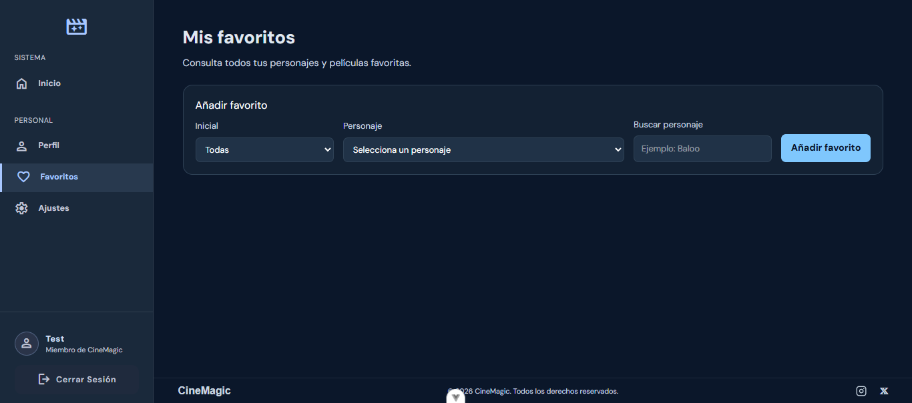
---

## 🛠️ Panel de administración

- Dashboard administrativo.
- Gestión de usuarios registrados.
- Gestión de personajes destacados.
- Selección del **Personaje de la Semana**.
- Configuración del perfil del administrador.
- Administración centralizada del contenido.
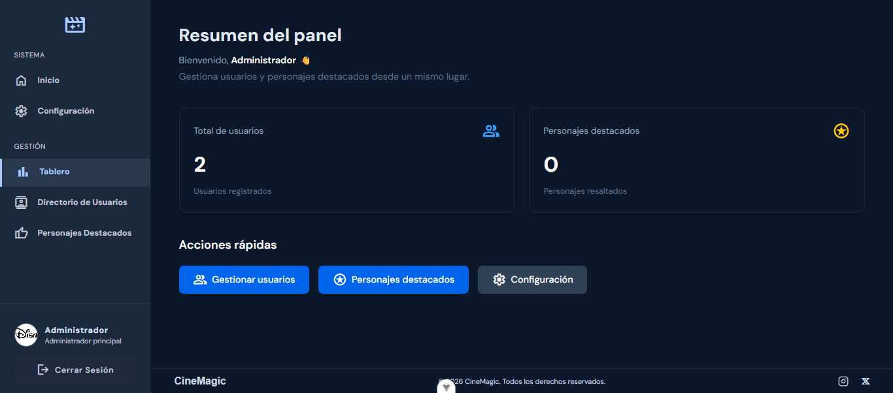
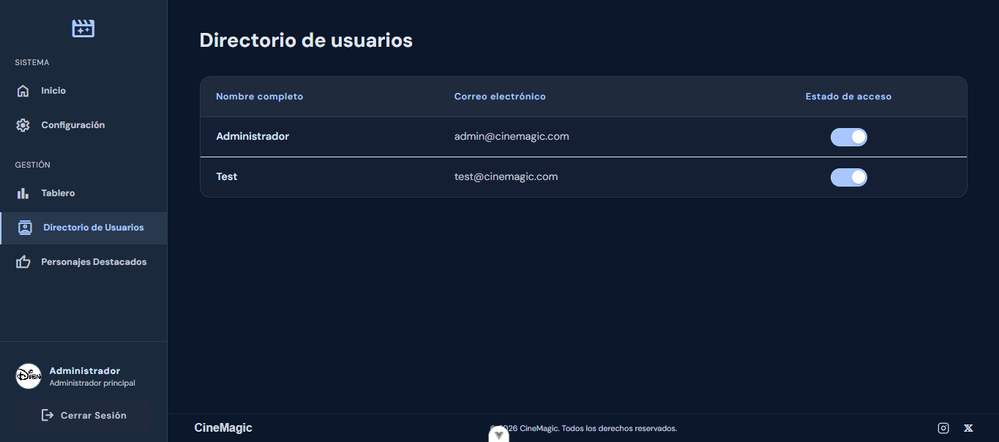
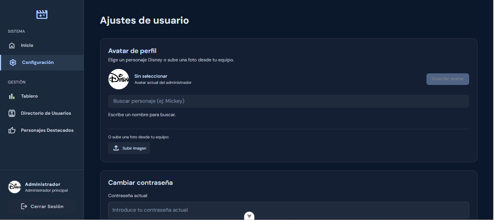
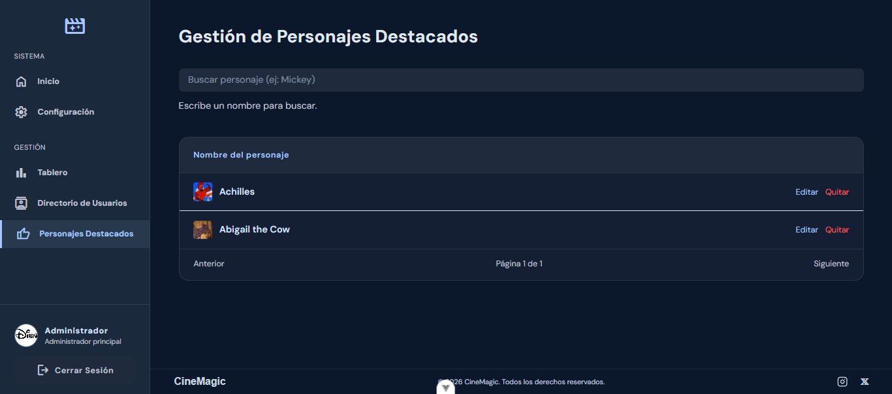
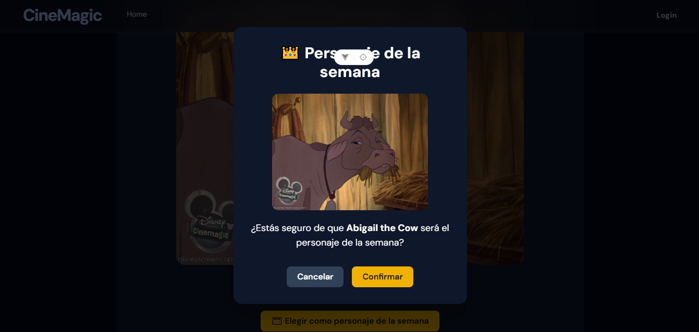
---

## 🧪 Testing

- Pruebas unitarias desarrolladas con **Vitest**.
- Pruebas End-to-End implementadas con **Playwright**.
- Verificación de la lógica de negocio y de los principales flujos de navegación.
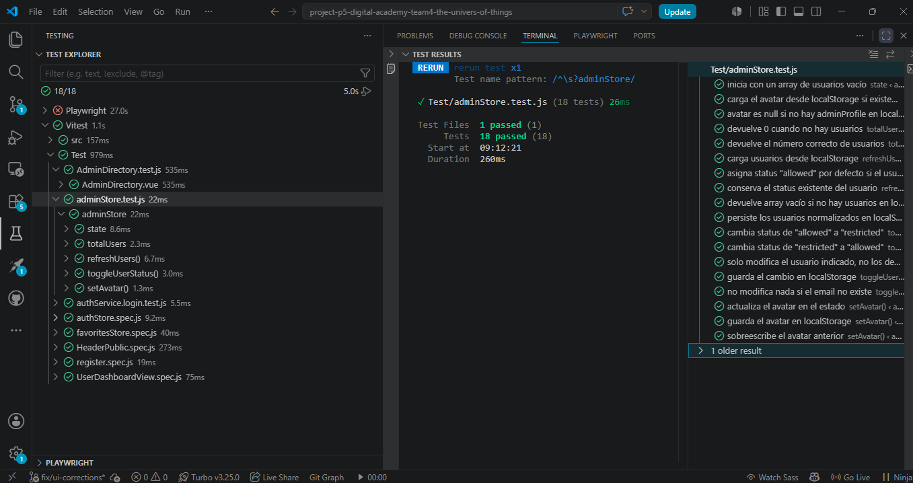
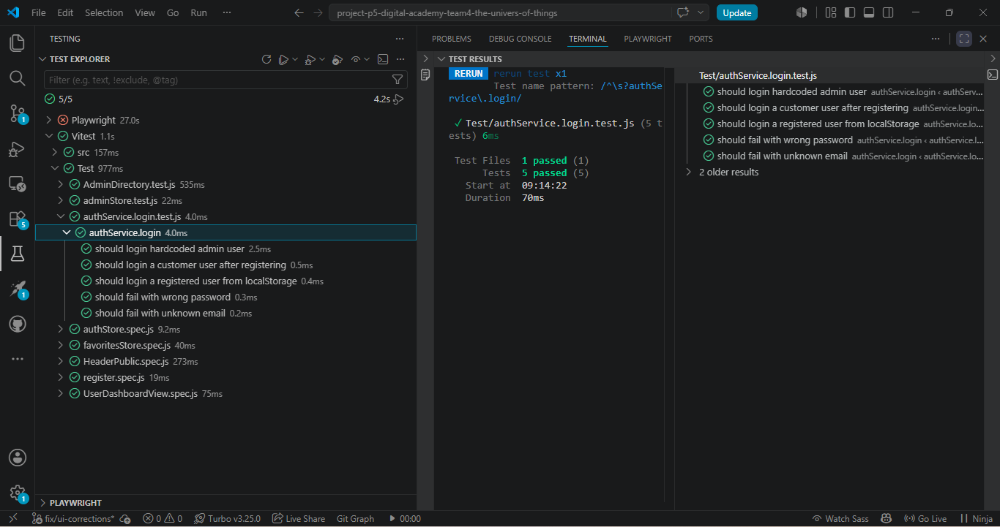
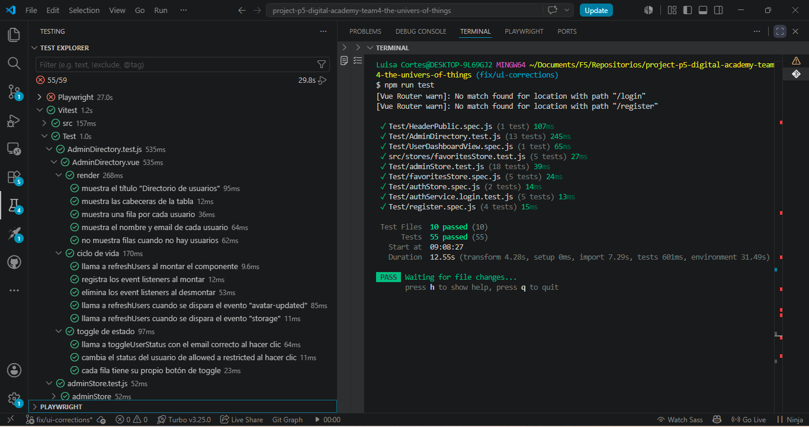
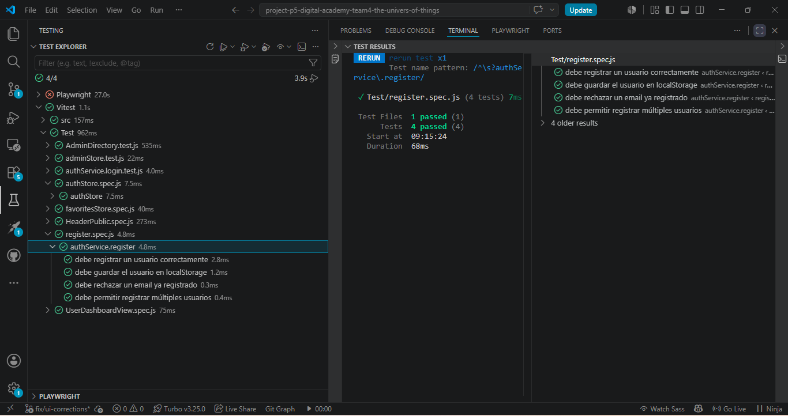
---
# 🛠 Tecnologías utilizadas

- Vue 3
- Vite
- Vue Router
- Pinia
- Tailwind CSS
- SCSS
- Disney API
- LocalStorage
- Vitest
- Playwright
- Git
- GitHub

# 👩‍💻 Equipo de desarrollo

| Integrante | Funcionalidades |
|------------|-----------------|
| Andrea  | Homepage, Character Detail, Top Rated by Users, Personaje de la Semana, Sistema de favoritos y valoraciones, Testing |
| Gema | Área privada, Perfil de usuario, Ajustes de cuenta, Header autenticado, Gestión de favoritos |
| Rana | Login, Registro, Autenticación, Gestión de sesión |
| Luisa | Panel de administración, Dashboard, Gestión de usuarios, Personajes destacados y Configuración del administrador |
